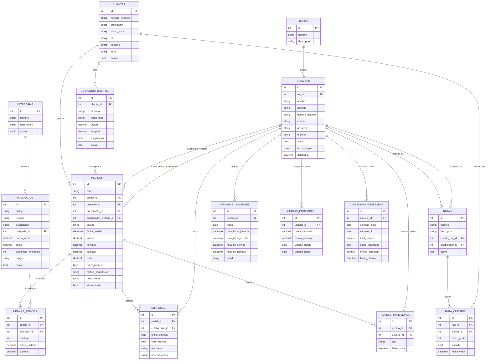

# PREVENTRACK
# Modelo de Base de Datos

**Proyecto:** Preventrack - Sistema Integral de Preventa y Gestión de Distribución Comercial

**Versión:** 1.0

**Fecha:** Julio 2026

---

# Introducción

Este documento describe el modelo de base de datos de Preventrack, derivado de la Propuesta de Proyecto (`01_Propuesta_proyecto`) y de la Lógica del Negocio y Requerimientos Funcionales (`03_Logica_negocio_Requerimentos_funcionales.md`). El script SQL correspondiente se encuentra en `base_datos/preventrack_schema.sql`.

Motor de base de datos: **MySQL 8.x** (InnoDB, utf8mb4).

---

# Decisiones de diseño

- **Eliminación lógica (soft delete):** `usuarios`, `productos`, `categorias` y `clientes` usan `deleted_at` en lugar de borrado físico, porque pueden estar referenciados por pedidos históricos (RF-02, RF-03, RF-04). El resto de tablas no lo requiere porque son registros transaccionales o de historial que no se eliminan.
- **Un usuario, un rol:** el documento de negocio indica "cada usuario tendrá un rol asignado" (singular). La posibilidad de que un mismo colaborador haga preventa y entregas se resuelve con un único rol **Colaborador** que agrupa ambas funciones, no con múltiples roles por usuario.
- **Historial de comisiones/cuotas:** `cuotas_comisiones` guarda vigencias (`vigente_desde`/`vigente_hasta`) en lugar de sobrescribir un solo valor, para no perder la configuración con la que se calculó una comisión pasada.
- **Entregas como historial, no como estado único:** un pedido puede volver a "Pendiente" tras un intento fallido de entrega (según la lógica de negocio), así que cada intento se registra como una fila en `entregas`; `pedidos.estado` siempre refleja el estado *actual*.
- **Sin descuento de inventario:** `productos.existencia_referencia` es solo informativo/manual, conforme a la limitación explícita de que el sistema no descuenta inventario automáticamente.
- **Sin fotos/firmas de entrega y sin tabla de notificaciones:** omitidas a propósito, ya que están fuera del alcance de la primera versión.
- **Soporte para trabajo sin conexión:** `pedidos`, `entregas` y `jornadas_laborales` incluyen `uuid_offline` y `sincronizado` para que la app móvil genere identificadores localmente y el backend pueda resolver duplicados al sincronizar.

---

# Entidades

## roles
Catálogo de roles del sistema (Administrador, Supervisor, Colaborador). Determina permisos (RF-02).

## usuarios
Usuarios del sistema (administradores, supervisores, colaboradores). Cada uno tiene un rol y puede activarse/desactivarse sin eliminarse (RF-02).

## categorias
Categorías de productos (módulo "Gestión de categorías").

## productos
Catálogo de productos: código, nombre, descripción, categoría, precio de venta, costo, existencia de referencia (solo consulta) e imagen (RF-03).

## clientes
Negocios/clientes atendidos por los colaboradores: nombre del negocio, propietario, razón social, RFC, teléfono y zona (RF-04).

## domicilios_clientes
Uno o varios domicilios por cliente, con coordenadas opcionales y bandera de domicilio principal (RF-04).

## rutas
Rutas comerciales creadas por administrador o supervisor y asignadas a un colaborador (RF-08).

## ruta_clientes
Relación N:M entre rutas y clientes; guarda el orden de visita y si el cliente fue visitado o quedó pendiente dentro de la ruta.

## pedidos
Pedido registrado por un colaborador desde la app móvil. Guarda fecha/hora y coordenadas GPS automáticamente, el cliente, domicilio, preventista, colaborador de entrega asignado y estado (Pendiente, En ruta, Entregado, Cancelado) (RF-05, RF-06, RF-09).

## detalle_pedidos
Líneas de producto de cada pedido (producto, cantidad, precio unitario, subtotal), base para el ticket y los reportes de ventas.

## entregas
Historial de intentos de entrega de un pedido: colaborador que entrega, fecha/hora y resultado. Permite que un pedido regrese a "Pendiente" si no se entrega (RF-07).

## jornadas_laborales
Registro obligatorio de inicio/fin de jornada e inicio/fin de comida por colaborador y día (RF-10). La regla "no se puede iniciar una jornada nueva si hay una abierta" se valida a nivel de aplicación antes del insert.

## cuotas_comisiones
Configuración histórica de cuota semanal y monto de comisión, por colaborador y periodo de vigencia (RF-11).

## comisiones_generadas
Comisión calculada por colaborador y semana, una vez alcanzada la cuota vigente (RF-11).

## tickets_impresiones
Bitácora de impresiones/reimpresiones de ticket por pedido, con el usuario que imprimió (RF-12).

---

# Diagrama Entidad-Relación

---

# Trazabilidad con Requerimientos Funcionales

| RF | Tablas principales |
|----|---------------------|
| RF-01 Inicio de sesión | `usuarios`, `roles` |
| RF-02 Gestión de usuarios | `usuarios`, `roles` |
| RF-03 Gestión de productos | `productos`, `categorias` |
| RF-04 Gestión de clientes | `clientes`, `domicilios_clientes` |
| RF-05 Registro de pedidos | `pedidos`, `detalle_pedidos` |
| RF-06 Gestión de pedidos | `pedidos`, `detalle_pedidos` |
| RF-07 Gestión de entregas | `entregas`, `pedidos` |
| RF-08 Gestión de rutas | `rutas`, `ruta_clientes` |
| RF-09 Registro de ubicación | `pedidos` (`latitud`, `longitud`) |
| RF-10 Jornada laboral | `jornadas_laborales` |
| RF-11 Cuotas y comisiones | `cuotas_comisiones`, `comisiones_generadas` |
| RF-12 Impresión de tickets | `tickets_impresiones`, `pedidos`, `detalle_pedidos` |
| RF-13 Reportes | consultas sobre todas las tablas anteriores |
| RF-14 Funcionamiento sin conexión | `uuid_offline` / `sincronizado` en `pedidos`, `entregas`, `jornadas_laborales` |
| RF-15 Dashboard administrativo | `pedidos` (conteos por estado), `detalle_pedidos` (ventas del día) |

---

# Notas para implementación en Laravel

- Los nombres de tabla y columnas usan `snake_case` y plural, compatibles con las convenciones de Eloquent.
- Cada tabla incluye `created_at`/`updated_at`; las que aplican eliminación lógica incluyen además `deleted_at` (`SoftDeletes`).
- Las claves foráneas usan `ON DELETE RESTRICT` por defecto para proteger la integridad del historial de pedidos/comisiones, salvo en catálogos de apoyo (`domicilios_clientes`, `ruta_clientes`) donde `ON DELETE CASCADE` es seguro porque no tienen valor fuera de su padre.
- El script completo está en [`base_datos/preventrack_schema.sql`](../base_datos/preventrack_schema.sql).
